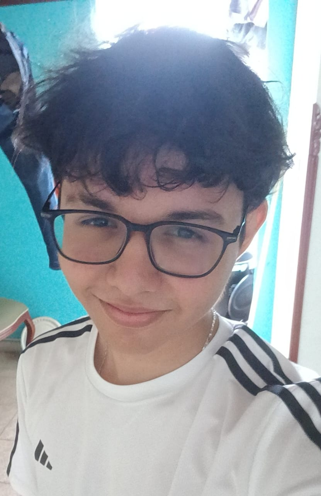

## Sebastián Felipe Rodríguez Rosas

¿Por qué cree que deberia pasar el primer corte de backend?
- Considero que deberia pasar el primer corte, debido a que, soy comprometido con las entregas y me interesa seguir aprendiendo y fomentando mi conocimiento en la materia para luego aplicarlo en mi futuro profesional.